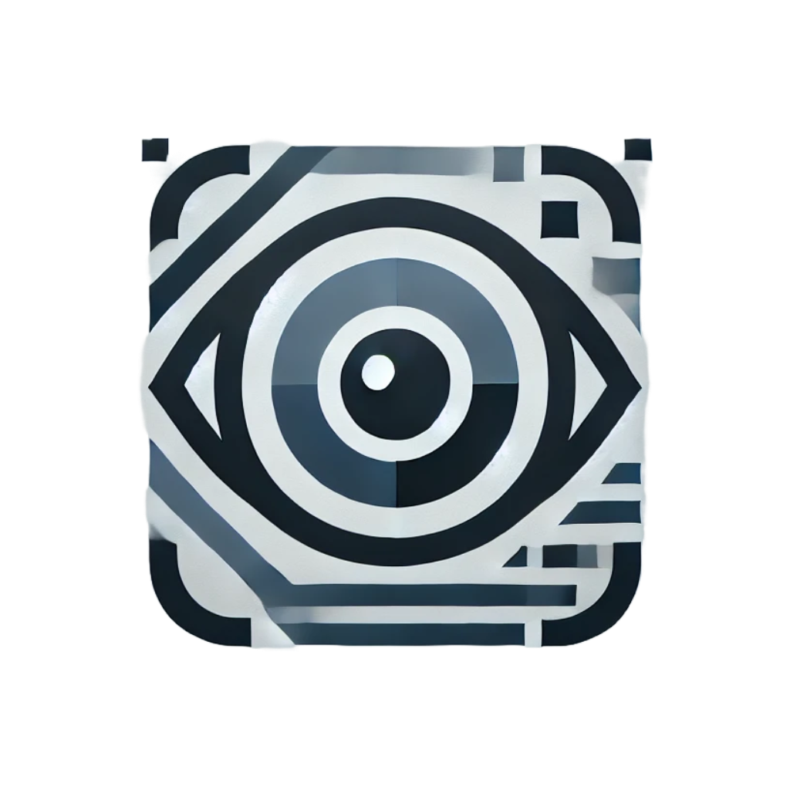

# NotyVisualScan



**NotyVisualScan** is a web interface that processes images stored in a Notion database. It can describe and tag your images using various AI models and automates many common tasks such as uploading files or chaining multiple steps together.

## Features
- **Generate image descriptions** via OpenAI, Anthropic, Google Gemini or DeepSeek models.
- **Automatically tag images** with an optional limit on the number of returned tags.
- **File upload automation** that attaches files to Notion entries by name using exact or approximate matching (e.g. `BD001-FG001`).
- **Manage prompts and models** directly from the UI.
- **Backup and restore** your configuration to JSON.
- **Automation workflows** with optional Pushover notifications when jobs start or finish.

## Important Notion Setup
The Notion database must contain:
- a **Rich Text** column used to store the generated description.
- a **Multi‑select** column used for tags.

Without these properties the application will not work correctly.

## Getting Started
### Method 1: Docker Compose (recommended)
1. Clone the repository and move into the project directory.
2. Set the environment variables (see below).
3. Build and run the app:
   ```bash
   docker-compose up --build
   ```
4. Open `http://localhost:5007` in your browser.

### Method 2: Python
1. Ensure Python 3.8+ and `pip` are installed.
2. (Optional) Create and activate a virtual environment:
   ```bash
   python3 -m venv venv
   source venv/bin/activate
   ```
3. Install dependencies:
   ```bash
   pip install -r requirements.txt
   ```
4. Set the environment variables and run the app:
   ```bash
   export FLASK_APP=app/app.py
   flask run --host=0.0.0.0 --port=5007
   ```
5. Visit `http://localhost:5007`.

## Environment Variables
Set these variables when launching the application:
- `SECRET_KEY`
- `NOTION_API_KEY`
- `OPENAI_API_KEY`
- `DEEPSEEK_API_KEY`
- `GEMINI_API_KEY`
- `ANTHROPIC_API_KEY`
- `PUSHOVER_TOKEN` *(optional, for push notifications)*
- `PUSHOVER_USER` *(optional, for push notifications)*

## Pushover Notifications
1. Create an account at [Pushover](https://pushover.net/) and install the app on your device.
2. Retrieve your **User Key** and create an **API Token**.
3. Set `PUSHOVER_USER` and `PUSHOVER_TOKEN` as environment variables.
4. Enable Pushover notifications from the NotyVisualScan settings.

You will now receive alerts when a process or automation starts or ends.

## Screenshots
<p align="center">
  
  <br/>Screenshot 1
</p>
<p align="center">
  
  <br/>Screenshot 2
</p>
<p align="center">
  
  <br/>Screenshot 3
</p>

## Updating
When rebuilding the Docker container **all internal configuration will be lost** (prompts, models, credentials, etc.). Always export a backup JSON file from the web interface before updating and import it again afterwards.

---
NotyVisualScan helps you manage and scale image processing in Notion with powerful automation and AI models.

